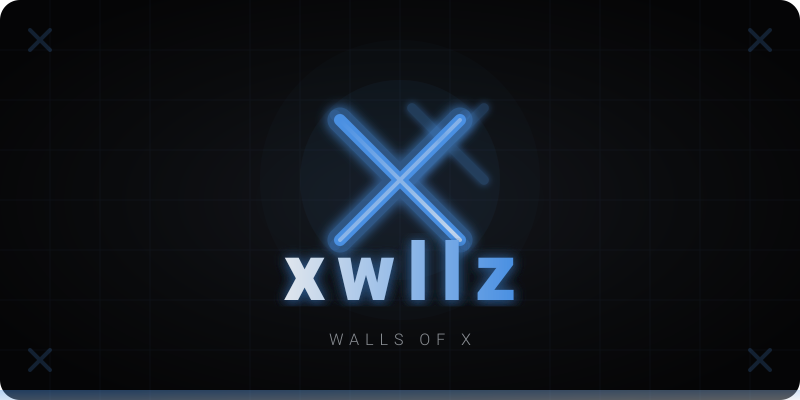
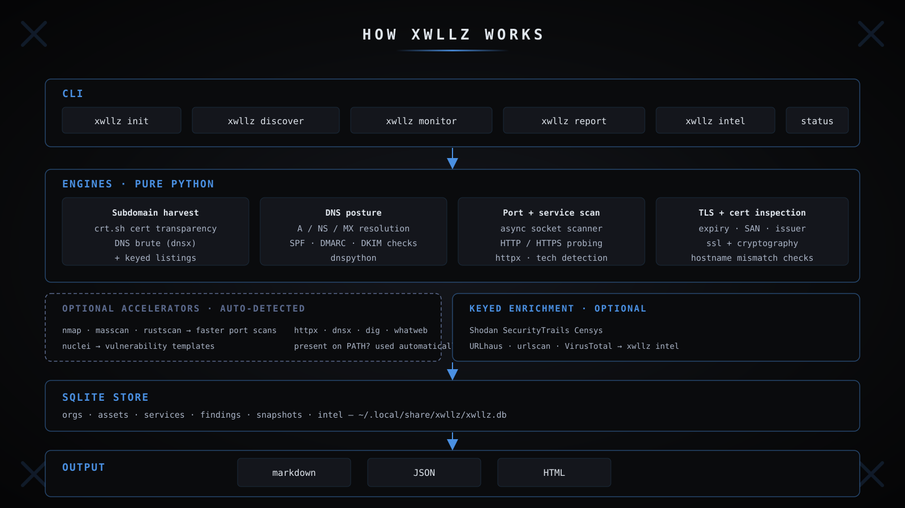
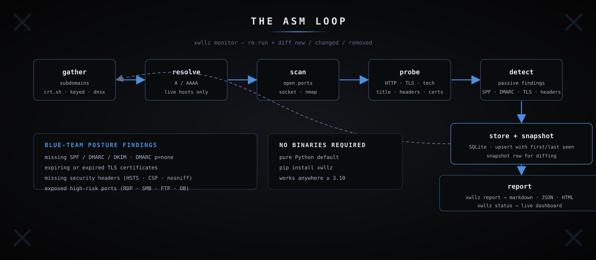

<p align="center">
  
</p>

# xwllz — Attack-surface management for blue teams

[](https://pypi.org/project/xwllz/)
[](https://pypi.org/project/xwllz/)
[](LICENSE)
[](https://github.com/stalane/xwllz-cli/actions/workflows/ci.yml)

`xwllz` is a CLI for discovering, monitoring, and reporting on your **own external
attack surface**. It maps the domains, subdomains, IPs, services, certificates, and
exposure points an attacker can reach — so blue teams can see their perimeter before
attackers do.

## How it works

<p align="center">
  
</p>

`xwllz` is **pure Python by default** — no system binaries required. It detects
optional accelerators (`nmap`, `masscan`, `rustscan`, `nuclei`, `httpx`, `dnsx`,
`dig`) on your PATH and uses them automatically when present, and falls back to
its built-in engines otherwise. Data is stored in SQLite.

## The ASM loop

<p align="center">
  
</p>

Each run produces a **snapshot**. `xwllz monitor` re-runs discovery and diffs
against the previous snapshot, showing you exactly what's **new, changed, or
removed** across your perimeter.

## Quickstart

```bash
pipx install xwllz

xwllz init acme --domains example.com,corp.example.com
xwllz discover acme
xwllz monitor acme        # re-scan and show what changed
xwllz report acme --format md
```

## Data sources

**Keyless by default:** crt.sh (certificate transparency), DNS (A/NS/MX/SPF/DMARC/DKIM),
HTTP probing, TLS/cert inspection, socket port scans.

**Optional keyed enrichment** (set env vars to enable):

| Source | Env vars |
|---|---|
| Shodan | `SHODAN_API_KEY` |
| SecurityTrails | `SECURITYTRAILS_API_KEY` |
| Censys | `CENSYS_API_ID`, `CENSYS_API_SECRET` |
| urlscan.io | `URL_SCAN_API_KEY` |
| URLhaus | `URLHAUS_API_KEY` |
| VirusTotal | `VIRUSTOTAL_API_KEY` |

## Commands

```
xwllz init <org> --domains d1,d2      define the scope to monitor
xwllz discover <org>                  enumerate the attack surface
xwllz monitor <org>                   re-scan and report new/changed/removed
xwllz report <org> --format md|json|html
xwllz status <org>                    current surface dashboard
xwllz intel <indicator>               URL/domain/IP lookup
xwllz whois <domain>                  whois lookup
xwllz cert <host>                     TLS certificate details
```

Data is stored in SQLite at `~/.local/share/xwllz/xwllz.db`.

## Disclaimer

This software is intended for defensive security purposes only. Use it solely on systems 
and networks you own or are explicitly authorized to test. The author(s) assume no liability 
for any damages or legal issues arising from misuse. 

Always comply with all applicable laws and regulations.

## License

MIT
